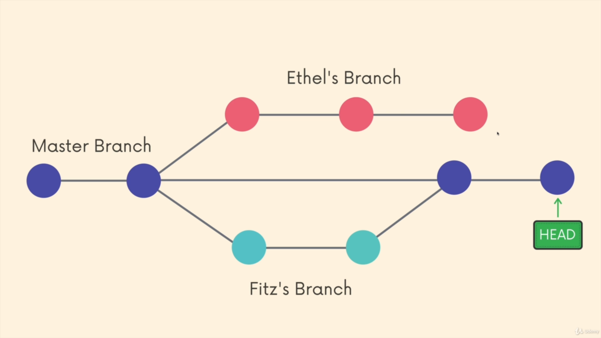

# Git Repository
here in this repo I store my all git commands which i learned.


- Use this to quit out of VIM editor if opened 
```bash
:wq
```

# Commands line codes

configuring email and password
```
    git config user.name
    git config user.email

    git config --global user.name " <Name here> "
    git config --global user.email " <Email here> "
```


- To get the status of the current comparison between commited files and local files in the system.
 ```
    git status  
```

- To intialise a repository to be a git repo use .
```
    git init
```

- Adding all the updates of the file made to the staging area.
 ```
    git add .
    git add file1 file2 
    ( add file name specified only )
```

- Commiting the repo means grouping all the changes and having a snap of the repository. Commiting means taking a snapshots of our repository that the time.
 ```
    git commit -m " "
    git commit -a -m " "
    ( doing staging and commiting in the same line )
```

- Retrives the previous commits on the branch you made and displays all of them.
 ```
    git log 
    git log --oneline
    ( shows only one line of log history )
```

- use this link to shift from vim editor commit panel to visual studio code terminal 
BENEFIT - can add more lines ( to the very atomic level )
```
    https://git-scm.com/book/en/v2/Appendix-C%3A-Git-Commands-Setup-and-Config 
```

- displays all the branch
```
  git branch 
```

- creating branch and working in branch
```
  git branch <branch - name>
  git switch <branch - name>
  
  git switch -c <branch - name> 
  ( create and switch in one step )

  git checkout -b <branch - name>
  ( creates and switches to new branch )
  git push origin <branch - name>
```

- Head is pointer and its also is called as bookmark in the book. It is refers to the current location in the git repository. Head refers to the branch pointer ( where the branch points currently ), the branch you are currently working on.
.png)


- deleting branches ( you should remain checked out that branch which is going to be deleted )
```
  git branch -d <branch - name> 
  ( it asks for permission and then delete the branch)
  git branch -D <branch - name>
  ( it forcefully deletes branch )
```

- renaming the branch ( rename needs you to be in the same branch which is to renamed )
```
  git branch -m <branch-name>
```

- for resolving conflicts
```
    check and update the merged branch
    remove unnecessary markers
    add everything to staging area 
    commit your changes
    * THE CONFLICT has been resolved
```

- compares staging area and working directory
```
    :q => quit the default editor 
    git diff
    git diff <file>

    git diff Head
    git diff HEAD <file>
    ( compares with the HEAD )

    git diff --staged / cached <file>
    ( compares with the staged files )
```

- compare 2 branch
```
    git diff branch1 branch2
```

- restore the commited repo ( reverting back to the commited repo )
```
    git restore <file>
    ( restore everything where HEAD is )
    git restore --source HEAD~( numb ) <file>
    ( it means simply means to revert numb commits back )
```

- unstaging the changes using restore command
```
    git restore --staged <file>
```

- reseting the HEAD to some old commit
```
    git reset <commit - hash> 
    ( the changes will retain )
    git restore HEAD

    git reset --HARD <commit - hash>
    ( the changes made are lost )
```

- cloning means copy repository from outside of the local system git 
( best usage is copying other person repository )
```
    git clone " url "
```

- here is how add remote add origin ( added external git repo origin in the local system ).
```
    git remote -v
    ( gives origin details )

    git remote add origin url 
    ( origin is a conventional git remote name )
```


